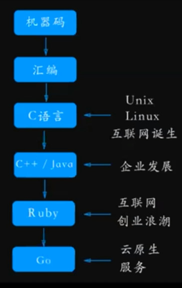

# 上海科技大学 GeekPie WorkShop#7

## 原视频

[视频链接](https://www.bilibili.com/video/BV1ti4y1b7xy?from=search&seid=3999632637077780986)

## 张汉东老师的分享

### Rust 想解决什么问题

* 主流语言发展史

  
  
* 已有互联网世界

  * C/C++ 追求性能，埋下了不安全的隐患
  * Java 引入 GC 为了安全性牺牲性能
  * 硬件成本降低，大量互联网创业，技术不完善

* 未来会更加追求安全，可是**安全**需要付出一定代价才能得到保证

  目前，我们只能尽可能消除更多问题(如**内存安全**等问题)

* 2006 年，Mozilla 职员 Graydon Hore 也认识到未来互联网更加追求安全，也不想让历史中语言的优秀特性蒙尘

  要创造一门**安全**和**性能**兼备的语言：默认内存安全/默认线程安全/媲美 C/C++ 的性能

  Rust 语言命名的多重含义

### Rust 如何解决这些问题

* 和 Python/Java/C/C++/Go 语言相比：内存/线程安全、无 GC、高性能...

* Rust 语言的设计哲学：内存安全、零成本抽象、语言一致性、实用性

* Safe Rust 的心智模型，自下而上：

  最底层是**半自动内存管理**：基于栈和堆使用 RAII(来自 C++11) 进行内存管理；

  再上一层是**类型系统**：首先，**一切皆类型**；类型的行为通过 **Trait** 进行区分与描述；通过**泛型**对相同行为的类型相关的代码进行合并，包括**动态/静态分发**；

  再上一层是**语义层**：指针的引入不可避免，但在 C/C++ 中很容易造成内存不安全问题，这是因为 C/C++ 建立的指针模型过于简单，而在 Rust 中的**所有权系统**相对复杂，也更加严谨地实现了内存安全；

  > 以下是一些口胡的个人理解：
  >
  > 我们不妨考虑最简单的 `let y = x` 或者将 `x` 作为参数传进去的情况。这时编译器眼中，我们实际的目的取决于 `x` 的类型的行为。如果 `x` 实现了 `Copy Trait`，即可以**按位复制**，那么上述的过程被解释为**复制语义**：即直接将 `x` 复制一份，将这块数据**绑定**到 `y` 或者函数的输入参数上面即可；否则，说明 `x` 不允许按位复制，很有可能是 `x` 本身是指向一块数据的**引用类型**，像上面那种做法复制一份并绑定到新的变量，就会导致两个不同的引用类型指向同一块数据，造成内存不安全问题。此时就应该取**移动语义**，也就是将 `x` 的所有权转移到其他变量。
  >
  > 当开始涉及引用的时候一切就变得更为复杂。我们通过从一块数据的所有者那里进行**借用**而得到一个**引用**。在这里，无论是否是引用，**作用域**和**生命周期**应该都是一个意思。
  >
  > 我们知道，显然有一些比较简单的规则：首先，引用的生命周期只能是被借用者生命周期的一个子集，不然，悬垂指针会由此诞生；其次，从同一个被借用者那里借用来的多个引用要满足**读者-写者要求**——这是因为，如果同时存在两个可变借用或可变/不可变借用同时存在，在多线程环境下会产生竞态条件/数据竞争，这显然不被严格要求内存/线程安全的 Rust 所容忍。
  >
  > 然而，上面的规则虽然比较基础且重要，但却是在被借用者以及向它借用的多个引用均明确**处于同一个作用域**的情况下才能起作用的。考虑一个函数的输入、输出存在引用，或者结构体的某些字段存在引用的情况。对于前者，本来局部变量和输入、输出参数在一段确定的历史(指这个函数的作用域)中各自存活一段时间，从诞生到消亡，犹如天道轮回恒久不变；但输入、输出参数中存在的引用却跳脱出这一段历史，从这个函数**自身的视角**，在**没有附加信息**的情况下，它不能判断函数中与这些引用相关的代码是否能通过上面那些简单的借用检查。这显然玷污了 Safe Rust 的净土，是 Rust 所不能接受的。同理，对于后者，在结构体 impl 的函数中，它也需要附加的信息来说明结构体本身的生命周期、结构体字段中存在的引用的生命周期两两之间到底是什么关系。随即，编译器才能在编译这个函数的时候来检查相关的代码是否能满足相关的要求。
  >
  > 那么，所谓的附加信息是什么？我们通过**生命周期参数**来给这些神龙见首不见尾的引用们一些限制，它们形如 `'a, 'b` 这样的东西。这里又涉及到生命周期泛型的自动推导，以及通过 Trait bound 来进行引用之间生命周期关系的限定，这里先挖坑。但我们要知道的是，我们在函数签名上所加的泛型限制，目的仅仅是为了使得函数中与各个生命周期未知的引用相关的代码能通过编译器相关的检查，从而达到某种程度上的**自洽**。
  >
  > 为什么仅仅说是**自洽**而非正确呢？这是因为函数内部各部门虽然已经艰难达成了共识，满足了编译器的限制——但函数的调用者却未必遵循函数签名上所设置的各引用生命周期之间的关系限制。我们知道，在函数调用的上下文中，我们可以明确知道所传进去的各引用的具体生命周期，那么此时编译器就能对他们再一次进行检查，确认调用者有没有按照人家的规矩办事(也即，带生命周期泛型的函数通过**展开**对各泛型进行**实体化**的过程是否合法)。在这次检查没有问题之后，我们才终于可以松一口气，说：终于过编译了。
  >
  > 这里其实有一个问题，就是：从这种观点来看，编译器其实并不需要函数内部通过进行各引用的生命周期关系限制来达到自洽，只需要在函数调用的时候，看看函数中相关的代码是否在传进去的各引用的具体生命周期设置下没有问题即可？但，从张汉东老师后续的答疑来看，编译器并不能做到这一点。因此，才需要**生命周期参数**的存在。
  
  我们需要基于 Rust 的心智模型做类型设计并编写代码，这样才不会屡屡受到编译错误的打击。
  
* 若干代码示例

  ```rust
  // 所有权
  let x = Vec::new();
  let y = x; // 由于 x 是一个引用类型，所有权被转移给 y
  drop(x); // Err: x 不与任何数据绑定，不能 drop
  
  // 借用检查：借用的生命周期不能超过被借用者的生命周期
  let mut x = vec![1, 2, 3];
  let first = &x[0];
  let y = x; // 同理，所有权被转移给 y
  println!("{}", *first); // Err: 所有权被转移后，所有借用它的引用自动失效
  
  // 绑定默认不可变
  let v = Vec::new();
  println!("{}", v.len()); // 编译通过，没有改变 v
  v.push(10); // Err: v 并非可变绑定
  
  // 对可变绑定进行借用才能进行可变借用
  
  // Send: 在线程间安全传递所有权
  // Sync: 在线程间安全共享不可变借用
  // 这里举了 Rc 和 Arc 进行对比作为例子
  
  // 鲁棒性： Option<T> 以及 Result<T, E>
  
  // - 编译期内存分配
  // 实现了 Copy Trait 可以按位复制的类型，基本上都存储在栈上
  let x = 42;
  let z = [0; 1024];
  // 但是，也可以通过智能指针 Box<T> 将数据存在堆上，同时返回一个指向这段数据的引用存在栈上
  let heap_x = Box::new(x);
  let heap_z = vec![0; 1024];
  // 可以切换全局堆内存分配器
  #[global_allocator]
  static A: MyAllocator = MyAllocator;
  // - 泛型的分发
  // 编译期静态分发
  impl<T> MyVec<T> {
      ...
  }
  // 运行期动态分发，查虚表 vtable
  pub fn find(&self, f: &dyn Fn(&T) -> bool) -> Option<&T> {
      ...
  }
  ```

* Rust **零成本抽象**的基石：Trait，是对类型行为的抽象

  Trait 一共有四种作用：

  1. 接口；
  2. Trait bound
  3. 类型标签，Copy/Sized/Send/Sync
  4. Trait Object

* Rust 中的元编程支持：强大的宏

* Safe 与 Unsafe

  Unsafe: 编译器和共同编程的同伴相信你，你不要辜负他们的信任

  然而，一旦出了问题，我们应当先去检查 Unsafe 的部分

* 零开销 FFI: 调用 C 函数；或使得 Rust 自己的函数可以被 C 代码调用

### 生产领域的 Rust 应用

* 目前对这些不是很感兴趣，就先不做记录了
* Rust 当前存在的缺点
  1. 学习曲线高，
  2. 编译较慢：需要不断进行优化
  3. 在持续迭代中，特性不是非常稳定
  4. 有些语言特性还待完善(如 async Rust 等)

### Rust 如何让你成为更好的开发者

* 可以跟进时代变革的脚步，这是因为由于 Rust 既能保证安全，又能保证高性能。目前很多领域都在一致使用 Rust，可以降低其他语言的学习成本。
* 与 Rust 编译器斗智斗勇的过程，能促进养成一种**先思考、再动手**的习惯，避免一切凭着感觉走
* 能对内存/线程安全养成一种系统认知
* 能够高效产出正确的程序

### 答疑

* "如何看待 Rust 对生命周期的保守检查导致语言表达能力的下降？"

  > 生命周期是为了避免代码中出现悬垂指针。
  >
  > 在一个函数内部(一个明确的作用域中)，编译器容易检查哪些引用是不合法的、
  >
  > 但是，在函数之间传递这些引用的时候，编译器就无法进行检查了。然而，如果不解决这个问题的话安全性就不能得到保证了。目前最好的解决方案就是通过生命周期参数。当然，适当使用第三方库、数据结构或者设计模式可以绕过该问题。
  >
  > Rust 也在不停对于生命周期参数进行优化，包括提供更详细的报错信息。
  >
  > 学习生命周期参数的重点：搞清楚一些都是为了避免**悬垂指针**，另外，要区分参数传递时的**形参**与**实参**。

